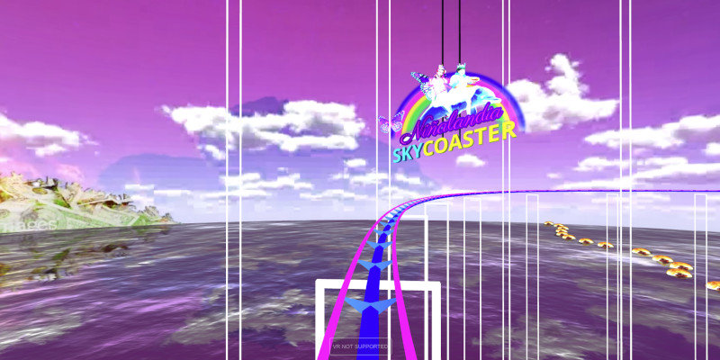

# Niñalandia Skycoaster



A VR-compatible 3D roller coaster made in Blender and Three.js. Take a ride through the post-apocalyptic, queer futurist utopia of Niñalandia. 

## Live Demo

Click [here](https://btevc.net/xRamp?_bh=bowT&_px=skycoaster) to ride.

## Installation

### Linux and Mac

```bash
git clone https://github.com/arcbo-t/skycoaster.git
cd skycoaster
./run
```

### To View in VR

1. Upload the repo directory to a web server using FTP/SFTP
2. Navigate to the address in your VR headset's native browser
3. Select the 'Enter VR' button. 
